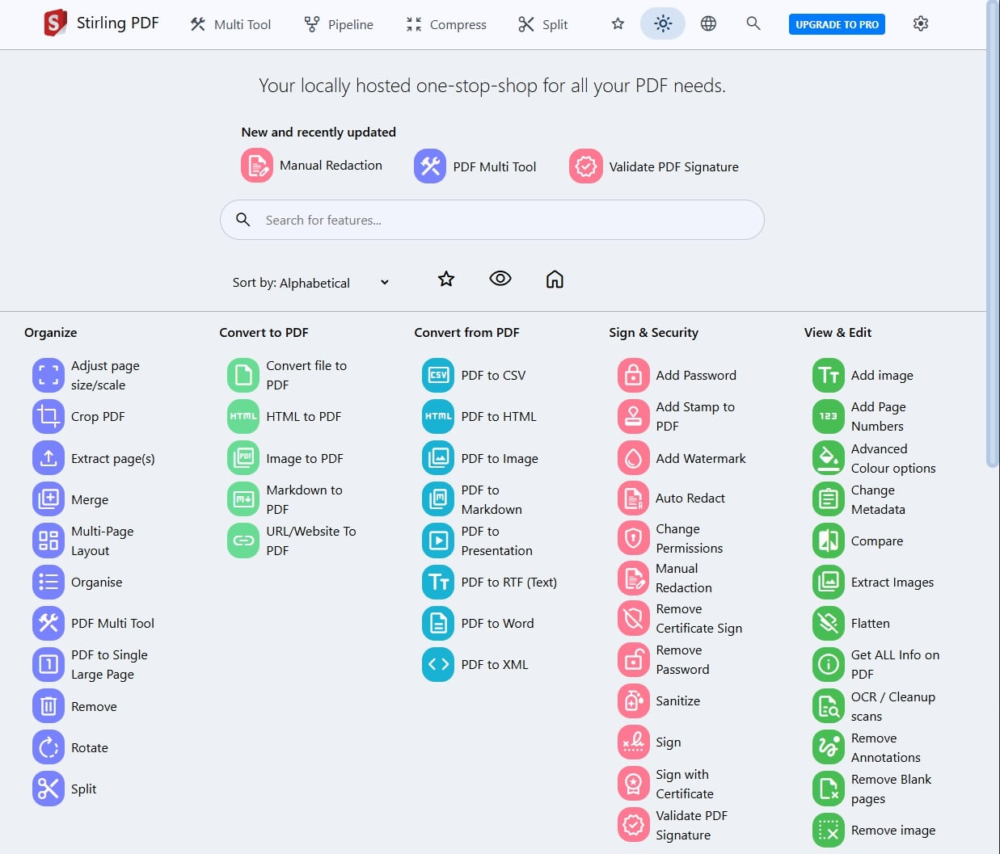

<h1 align="center">Stirling-PDF</h1>

## Features

- 50+ PDF Operations
- Parallel file processing and downloads
- Dark mode support
- Custom download options
- Custom 'Pipelines' to run multiple features in a automated queue
- API for integration with external scripts
- Optional Login and Authentication support (see [here](https://docs.stirlingpdf.com/Advanced%20Configuration/System%20and%20Security) for documentation)
- Database Backup and Import (see [here](https://docs.stirlingpdf.com/Advanced%20Configuration/DATABASE) for documentation)
- Enterprise features like SSO (see [here](https://docs.stirlingpdf.com/Advanced%20Configuration/Single%20Sign-On%20Configuration) for documentation)

## PDF Features

### Page Operations

- View and modify PDFs - View multi-page PDFs with custom viewing, sorting, and searching. Plus, on-page edit features like annotating, drawing, and adding text and images. (Using PDF.js with Joxit and Liberation fonts)
- Full interactive GUI for merging/splitting/rotating/moving PDFs and their pages
- Merge multiple PDFs into a single resultant file
- Split PDFs into multiple files at specified page numbers or extract all pages as individual files
- Reorganize PDF pages into different orders
- Rotate PDFs in 90-degree increments
- Remove pages
- Multi-page layout (format PDFs into a multi-paged page)
- Scale page contents size by set percentage
- Adjust contrast
- Crop PDF
- Auto-split PDF (with physically scanned page dividers)
- Extract page(s)
- Convert PDF to a single page
- Overlay PDFs on top of each other
- PDF to a single page
- Split PDF by sections

### Conversion Operations

- Convert PDFs to and from images
- Convert any common file to PDF (using LibreOffice)
- Convert PDF to Word/PowerPoint/others (using LibreOffice)
- Convert HTML to PDF
- Convert PDF to XML
- Convert PDF to CSV
- URL to PDF
- Markdown to PDF

### Security & Permissions

- Add and remove passwords
- Change/set PDF permissions
- Add watermark(s)
- Certify/sign PDFs
- Sanitize PDFs
- Auto-redact text

### Other Operations

- Add/generate/write signatures
- Split by Size or PDF
- Repair PDFs
- Detect and remove blank pages
- Compare two PDFs and show differences in text
- Add images to PDFs
- Compress PDFs to decrease their filesize (using qpdf)
- Extract images from PDF
- Remove images from PDF
- Extract images from scans
- Remove annotations
- Add page numbers
- Auto-rename files by detecting PDF header text
- OCR on PDF (using Tesseract OCR)
- PDF/A conversion (using LibreOffice)
- Edit metadata
- Flatten PDFs
- Get all information on a PDF to view or export as JSON
- Show/detect embedded JavaScript

# 📖 Get Started

Visit our comprehensive documentation at [docs.stirlingpdf.com](https://docs.stirlingpdf.com) for:

- Installation guides for all platforms
- Configuration options
- Feature documentation
- API reference
- Security setup
- Enterprise features

## Supported Languages

Stirling-PDF currently supports 40 languages!

| Language                                     | Progress                               |
| -------------------------------------------- | -------------------------------------- |
| Arabic (العربية) (ar_AR)                        |    |
| Azerbaijani (Azərbaycan Dili) (az_AZ)        |    |
| Basque (Euskara) (eu_ES)                     |    |
| Bulgarian (Български) (bg_BG)                |    |
| Catalan (Català) (ca_CA)                     |    |
| Croatian (Hrvatski) (hr_HR)                  |    |
| Czech (Česky) (cs_CZ)                        |    |
| Danish (Dansk) (da_DK)                       |    |
| Dutch (Nederlands) (nl_NL)                   |    |
| English (English) (en_GB)                    |  |
| English (US) (en_US)                         |  |
| French (Français) (fr_FR)                    |    |
| German (Deutsch) (de_DE)                     |    |
| Greek (Ελληνικά) (el_GR)                     |    |
| Hindi (हिंदी) (hi_IN)                          |    |
| Hungarian (Magyar) (hu_HU)                   |    |
| Indonesian (Bahasa Indonesia) (id_ID)        |    |
| Irish (Gaeilge) (ga_IE)                      |    |
| Italian (Italiano) (it_IT)                   |    |
| Japanese (日本語) (ja_JP)                    |    |
| Korean (한국어) (ko_KR)                      |    |
| Norwegian (Norsk) (no_NB)                    |    |
| Persian (فارسی) (fa_IR)                      |    |
| Polish (Polski) (pl_PL)                      |    |
| Portuguese (Português) (pt_PT)               |    |
| Portuguese Brazilian (Português) (pt_BR)     |    |
| Romanian (Română) (ro_RO)                    |    |
| Russian (Русский) (ru_RU)                    |    |
| Serbian Latin alphabet (Srpski) (sr_LATN_RS) |    |
| Simplified Chinese (简体中文) (zh_CN)         |    |
| Slovakian (Slovensky) (sk_SK)                |    |
| Slovenian (Slovenščina) (sl_SI)              |    |
| Spanish (Español) (es_ES)                    |    |
| Swedish (Svenska) (sv_SE)                    |    |
| Thai (ไทย) (th_TH)                           |    |
| Tibetan (བོད་ཡིག་) (bo_CN)                     |  |
| Traditional Chinese (繁體中文) (zh_TW)        |    |
| Turkish (Türkçe) (tr_TR)                     |    |
| Ukrainian (Українська) (uk_UA)               |    |
| Vietnamese (Tiếng Việt) (vi_VN)              |    |
| Malayalam (മലയാളം) (ml_IN)              |    |

## Stirling PDF Enterprise

Stirling PDF offers an Enterprise edition of its software. This is the same great software but with added features, support and comforts.
Check out our [Enterprise docs](https://docs.stirlingpdf.com/Pro)

## 🤝 Looking to contribute?

Join our community:
- [Contribution Guidelines](CONTRIBUTING.md)
- [Translation Guide (How to add custom languages)](devGuide/HowToAddNewLanguage.md)
- [Developer Guide](devGuide/DeveloperGuide.md)
- [Issue Tracker](https://github.com/Stirling-Tools/Stirling-PDF/issues)
- [Discord Community](https://discord.gg/HYmhKj45pU)
